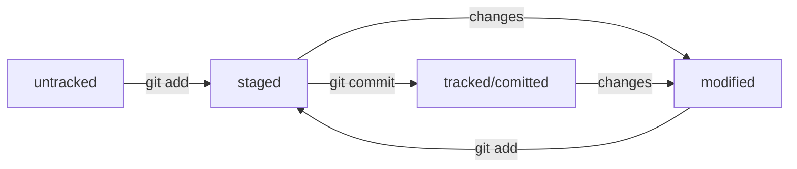

# Very Basic Git Guide

## Git getting ready

### What is Git

Git - is Version Control System for individual projects and teamwork. It lets you save changes locally and get back to previous versions of your code. 

### Install Git for Windows

Follow the [link](https://git-scm.com/download/win) 

Download the corresponding version

Run the Installation Wizard

Git Bash is installed together with Git for Windows

Open Git Bash and enter the following command:

```
git version
```

If Git is installed, then command will result in version of Git installed

### Git Bash

Git Bash is the command line interface that will help you to get on with Git quite quickly

Useful commands (all of them could be run with flags, to see them, pring `{command} --help`:

pwd - prints working directory

cd - changes directory

ls - shows list of directory content

mkdir - creates new directory

touch - creates new file

cp - copies files and directories

mv - moves files and directories

cat - reads text files

rm - deletes files

rmdir - deletes empty directories

rm -r - deletes non-empty directories

### Git settings

Git settings are stored in ```.gitconfig``` file.

First of all put your name and email in config file: 

```
$ git config --global user.name "User Namovich" 

$ git config --global user.email username@yandex.ru
```

Check that changes have been applied:

```
$ git config --list 
```

or

```
$ cat ~/.gitconfig 
```

Command line will respond with:

```
user.name=Username
user.email=username@yandex.ru 
```

### Repository initialisation

To initialize repository, navigate to corresponding directory and run the following command there:

```
$ git init
```

If you need to de-git directory you could do the following:

```
$ rm -rf .git
```

To check repo status, run the following command:

```
$ git status
```

It will show:

* name of current branch

* message that there is no commint yet in this repo

* message that says - "to commit something, create it at first"

### Add files to repo

New files in repo are untracked. To start tracking files use the following command:

```
$ git add --all
```

or

```
$ git add {name of file}
```

or

```
$ git add .
```

to track all files in the directory

### Commit

To make a commit run the following command:

```
$ git commit -m 'My first commit!' 
```

After executing the command, current version of files will be saved in repo with message ```My first commit!```.

### Commit history

To check previous commits in branch, use the following command:

```
$ git log
```

It will show the list of commits in target brach with hash, author, date and message of commits.

### GitHub

GitHub is the platform to storage IT-projects and to work together on then with use of Git.

Sign up on GitHub and navigate to your profile via the link ```https://github.com/username```, where ```username``` is your name, that you chose during signing up.

Create new repository - navigate to tab **Repositories**, and click on green button **New**

Name your repo and click on button **Create repository**

### SSH key generation

To secure your repo you should use SSH key for push/pull requests

To generete SSH key do the following:

* Open terminal and run the following command:

```
$ ssh-keygen -t ed25519 -C "email, to which your accaount on GitHub is linked"
```

or

```
$ ssh-keygen -t rsa -b 4096 -C "email, to which your accaount on GitHub is linked"
```

After executing the command, the following message will be shown:

```
> Generating public/private rsa key pair.
```

* Choose the storage for keys. Simple variant - is to use home directory:

```
> Enter a file in which to save the key (C:\Users\<user_name>\.ssh\):[Press enter] 
```

* Programm will ask for **codephrase** for accessing the SSH key. You could leave it empty

```
> Enter passphrase (empty for no passphrase): [Type a passphrase]

> Enter same passphrase again: [Type passphrase again] 
```

* Everithing is ready! You could check that keys are generated by:

```
ls -a ~/.ssh 
```

There should be two files - with extension ```.pub``` and without extension. File ```.pub``` - is public, you could share it with web-sites and colleagues. File wihtout extension  - is private. Do not share it with anybody!

### Link SSH key to GitHub account

* Copy public SSH key:

```
$ clip < ~/.ssh/id_rsa.pub
# or:
$ clip < ~/.ssh/id_ed25519.pub 
```

or

```
$ cat ~/.ssh/id_rsa.pub

$ cat ~/.ssh/id_ed25519.pub
```

and copy the output.

* Navigate to GitHub, select **Settings** in account menu

* In the menu on the left click on item **SSH and GPG keys**

* In opened tab select **New SSH key**

* In field **Title** enter name of the key

* In field **Key type** should be **Authentication Key**

* In field **Key** copy your key from buffer

* Click on button **Add SSH key**

* Check the key by:

```
$ ssh -T git@github.com 
```

The following message will be shown:

```
The authenticity of host 'github.com (140.82.121.4)' can't be established. ED25519 key fingerprint is SHA256:+DiY3wvvV6TuJJhbpZisF/zLDA0zPMSvHdkr4UvCOqU. This key is not known by any other names. Are you sure you want to continue connecting (yes/no/[fingerprint])? 
```

Enter ```yes``` to continue:

```
Hi %YOUR_ACCOUNT%! You've successfully authenticated, but GitHub does not provide shell access. 
```

### Linking remote repo to local repo

Navigate to the page of remote repo, select ```SSH``` type and copy URL.

Open terminal, cd to the directory of local repo and run the following command:

```
$ git remote add origing git@github.com:%ACCOUNT_NAME%/first-project.git 
``` 

Check that repos are linked:

```
$ git remote -v
origin    git@github.com:%ACCOUNT_NAME%/%PROJECT_NAME%.git (fetch)
origin    git@github.com:%ACCOUNT_NAME%/%PROJECT_NAME%.git (push) 
```

### Synchronize remote repo with local repo

To push changes to remote repo, run the following command:

```
$ git push -u origin main
```

For the first time you need to run ```push``` command with flag ```-u``` and parameters ```origin``` and ```main (master)```. Flag ```-u``` links local and remote branches.

## Commit navigation

### Hash - commit identification

Git hashes commit information by algorithm SHA-1 (**S**ecure **H**ash **A**lgorithm) and gets unique hash for every commit. Usually hash is shot (40 chars in case of SHA-1) line, which contains numbers 0-9 and latin letters A-F.

* If hash is got twice for the same set of input data, result will be the same

* If something has been changed in source data, hash will change as well

Hash is the main commit identifier.

All hashes and the table ```hash -> commit info``` are stored by Git in service files. They are in hidden folder ```.git``` in project repo.

### Log

After ```git log``` has been executed, list of commits is shown.

```
$ git log
commit 4576fb15ff0315591586bba73ce251a1e074cb84 (HEAD -> master, origin/master)   (1)
Author: Roman Skripchenko <roman.skripchenko@mcc-soft.de>                         (2)
Date:   Thu May 30 16:06:48 2024 +0700                                            (3)

    Add info about hash, reaarrange file structure                                (4) 
```

Let's dig deeper into elements of description:

* line of numbers and letters after word **commit** is commit hash

* **Author** - author's name and their email address

* **Date** - date and time of commit creation

* commit message is at the end.

To get shortened log use ```git log --oneline``` - only several first hash symbols and commit comments will be shown for every commit.

### HEAD

While executing ```git log``` you could notice line ```(HEAD ---> master)```. File ```HEAD``` is one of service files in foldder ```.git```. It points to the last commit (most recent).

Inside of ```HEAD``` is reference to service file ```refs/heads/master```. If you peak into it, you could see the hash of the last commit.

With every commit made Git refresh ```refs/heads/master```, writing the hash of the last commit into it.

If you need to pass the last commit to come commad, you could use ```HEAD``` instead of hash.

### File statuses in git

There are several statuses, which files potentially could have:

* ```untracked```

Git "see" these files exist, but do not track their changes. ```untracked``` file doesn't have previous versions.

* ```staged```

After ```git add``` has been executed, file gets to the **staging area**, to the list of files, which will be in commit.

* ```tracked```

All files , in which Git track changes (one way or another)

* ```modified```

Means that Git compared file content with the last saved veraions of this file and found diffs.

#### Typical lifecycle of the file in Git



### How to read ```git status```

```git status``` shows only the following file states:

* ```staged``` (```Changes to be commited``` in ```git status``` output)

* ```modified``` (```Changed not staged for commit```)

* ```untracked``` (```Untracked files```)

